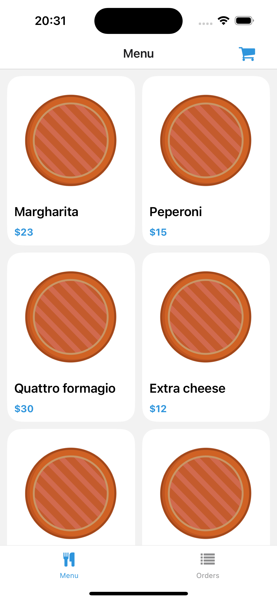

# RestaurantApp
React Native mobile application for a Pizza Restaurant
Fully completed application for a pizza restaurant with react native with supabase on the backend and everything is done in TypeScript.

1]The home page of the app is containing two screens one for the products available and one for the orders that the user made.

2]Product's detail page

